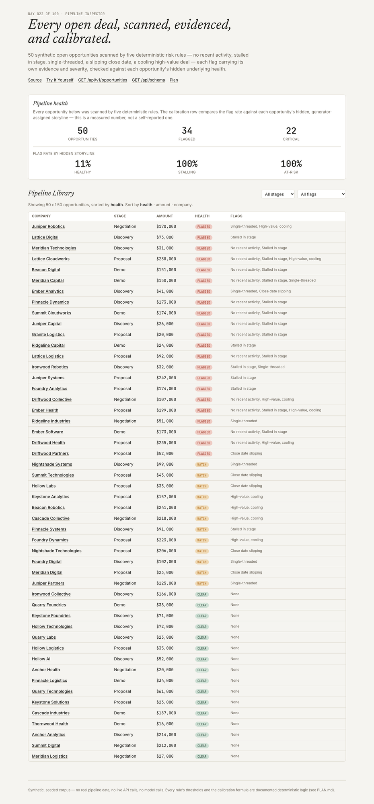
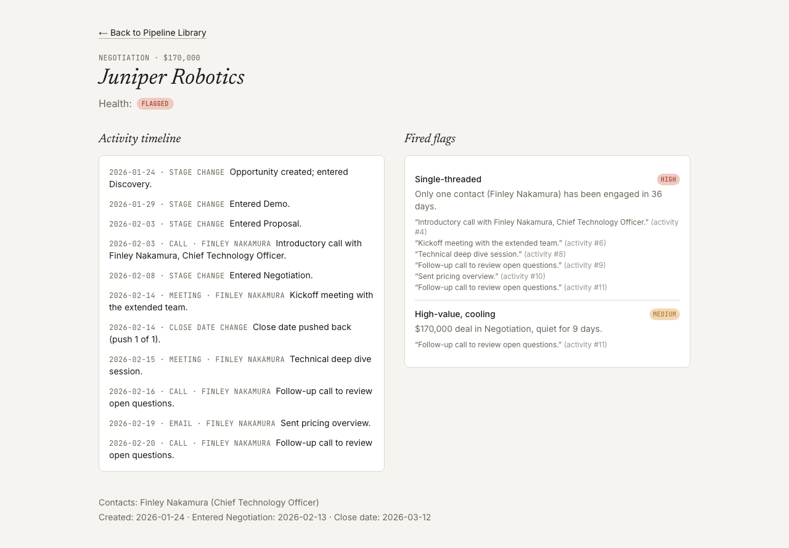
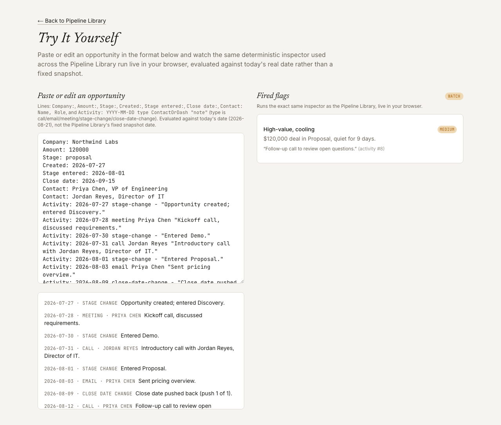

# Pipeline Inspector

A pipeline analysis tool that scans open opportunities for stalled or risky signals and shows the exact evidence behind every flag.

**[Live demo](https://pipeline-inspector-dun.vercel.app)** · [Plain-English guide](docs/plain-english-guide.md) · [`GET /api/v1/opportunities`](https://pipeline-inspector-dun.vercel.app/api/schema) · [Plan](./PLAN.md) · Day 022 of a 100-day building challenge.

## Why I Built This

An open pipeline hides its problems in plain sight. The numbers in a CRM report — stage, amount, close date — describe where a deal claims to be, not whether it's actually moving. Three failures repeat across every pipeline review:

1. **"Stalled" is a gut feeling, not a rule.** Two managers scanning the same pipeline flag different deals, because neither is applying the same threshold.
2. **Risk and staleness get conflated.** A deal can be right on schedule and still be risky (one contact, a slipping close date) — or stuck in a stage while still looking "engaged" (frequent activity, zero progress). Collapsing both into one vague "at risk" label hides which specific problem a rep needs to act on.
3. **Flags are asserted, never checked against outcomes.** A tool that says "this looks risky" without ever being tested against deals that actually stalled is asking for blind trust in the same way a demo is.

Pipeline Inspector's subject is those three failures: a deterministic scanner with documented, evidence-linked rules, five independent flags that never collapse into one opaque score, and a corpus-wide calibration check that proves the flags track genuinely unhealthy deals rather than noise.

## What It Does

50 synthetic open opportunities (`discovery` / `demo` / `proposal` / `negotiation` — no closed deals) are each scanned by five deterministic rules. Every fired flag carries its own severity (derived from the signal's own strength) and evidence (the exact activity-log entries that triggered it). Every opportunity rolls up to a `clear` / `watch` / `flagged` health level. Each opportunity also carries a hidden `outcomeProfile` (`healthy` / `stalling` / `at-risk`) fixed by the corpus generator and never read by the rules — the app computes a calibration readout comparing flag rate against that hidden profile, turning "identifies risky opportunities" into a measured claim.

## Demo

**Pipeline Library** — health panel (opportunities, flagged, critical, and the calibration split) above a sortable, filterable table:



**Opportunity detail** — full activity timeline next to every fired flag, with evidence:



**Try It Yourself** — paste or edit an opportunity, inspected live against today's real date:



## How It Works

```
data/                  corpus generation (opportunities + activity logs, seeded RNG)
                        + committed JSON + zod load schema
  ↓
lib/domain/              Opportunity, ActivityEntry, Contact, Evidence, Flag,
                          Inspection, OpportunityResult, PipelineSummary,
                          PipelineInspectionResult — types + zod
  ↓
lib/inspection/           the five rule checks + inspectOpportunity(opportunity,
                           asOfDate) + parseOpportunityText — pure, rule-based,
                           severity-assigning functions
  ↓
lib/pipeline-inspector/    orchestration — runs inspectOpportunity across the
                            corpus, aggregates PipelineSummary (flag rate by
                            outcomeProfile)
  ↓
app/                       three screens (library, opportunity detail, try-it)
                            + /api/v1/opportunities + /api/schema
```

### The five rules

| Flag | Fires when | Severity |
|---|---|---|
| No recent activity | ≥14 days since the last logged activity | low [14,21) · medium [21,35) · high 35+ |
| Stalled in stage | days in current stage ≥ its benchmark (discovery 10 / demo 14 / proposal 21 / negotiation 30) | low [1x,1.5x) · medium [1.5x,2x) · high 2x+ |
| Single-threaded | ≤1 distinct contact has ever engaged | medium if deal is <30 days old, else high |
| Close date slipping | 2+ `close-date-change` entries logged | medium at 2 · high at 3+ |
| High-value, cooling | $100k+ deal in proposal/negotiation, quiet 7+ days | medium [7,14) · high 14+ |

Every flag also carries evidence — the exact activity-log entries it fired from — and a plain-language `detail` line. Flags stack: `clear` (zero flags) → `watch` (exactly one low/medium flag) → `flagged` (any high-severity flag, or two or more flags at once).

### Calibration

The corpus generator writes a hidden `outcomeProfile` into each opportunity (`healthy` 40% / `stalling` 30% / `at-risk` 30%), split into subtypes that each construct an activity log designed to trip a specific rule. The rules never see this label. `npm run sweep` checks that the resulting flag rate is actually calibrated to it — on the committed corpus: **healthy 11%, stalling 100%, at-risk 100%**.

## Key Decisions & Tradeoffs

- **Decision:** Stalled and risky stay as five independent flags, never collapsed into one score.
  **Why:** A rep needs to know *which* problem to act on — "no recent activity" and "single-threaded" call for different next steps.
  **Tradeoff:** No single "risk score" to sort a dashboard by default; the health rollup (`clear`/`watch`/`flagged`) is a coarser proxy for that.

- **Decision:** Severity is computed inside each rule from its own signal's strength, never from the hidden `outcomeProfile`.
  **Why:** If severity were derived from the answer key, the calibration check would be circular — proving nothing.
  **Tradeoff:** A rule can occasionally be "confidently wrong" on an individual opportunity; the calibration claim is corpus-wide, not per-opportunity.

- **Decision:** Try It Yourself evaluates against **today's real date**, while the precomputed library uses the corpus's fixed `ANALYSIS_DATE` (2026-03-01).
  **Why:** The library needs to stay byte-identical forever for the sweep invariants; the sandbox needs to stay useful no matter when someone visits it.
  **Tradeoff:** The two pages are answering slightly different questions ("as of the snapshot" vs. "as of right now") — made explicit in the UI copy on both pages.

- **Decision:** No LLM, no live API calls, no real pipeline data — a seeded synthetic corpus with a hand-rolled rule engine.
  **Why:** Matches the zero-live-dependency convention held by every prior day in the series; keeps the repo runnable by anyone with no API key.
  **Tradeoff:** Proves the rule engine works, not that it survives messy real-world CRM data.

## Getting Started

### Prerequisites

- Node.js 20+
- npm

### Installation

```bash
git clone https://github.com/akshatiwarix/pipeline-inspector.git
cd pipeline-inspector
npm install
```

### Configuration

None. No environment variables, no API keys — the corpus is committed and every computation is local.

### Run Locally

```bash
npm run dev
```

Open [http://localhost:3000](http://localhost:3000).

## Usage

- Browse the **Pipeline Library** at `/`, sort by health/amount/company, filter by stage or flag type.
- Click any company to see its **activity timeline and fired flags** with evidence at `/opportunities/[id]`.
- Paste your own opportunity at **`/try-it`** using the documented line format (see the page itself for the grammar).
- `GET /api/v1/opportunities` returns the full precomputed result as JSON; `GET /api/schema` returns its zod-derived JSON Schema.
- Regenerate the corpus from its seed: `npm run corpus`.

## Validation / Testing

- `npm test` — 48 unit tests covering every rule's thresholds and severity ladder, the health rollup, evidence traceability, the calibration aggregation, and the Try It Yourself parser (including malformed-input handling).
- `npm run sweep` — nine corpus-wide invariants (size, outcome mix, field bounds, evidence traceability, inspection reproducibility, signal coverage, risk calibration, a healthy-floor sanity check, and full determinism across two runs). All nine pass on the committed corpus.
- Manually verified in-browser on the live deployment: the library's health panel and filters, an opportunity detail page for a `flagged` opportunity, and Try It Yourself's live re-inspection on both the prefilled example and a hand-edited replacement — including a deliberately malformed line, which is skipped and counted rather than crashing the page.

## Limitations

- Synthetic corpus only — proves the rule engine and calibration methodology, not survival against messy real CRM exports (missing fields, inconsistent date formats, contacts with the same name, etc.).
- Thresholds ($100k, 14-day gap, per-stage benchmarks) are fixed and documented in `PLAN.md`, not user-configurable.
- No write path — nothing here edits or persists a real pipeline; it's read-only analysis.
- The five rules are independent single-signal checks — there's no reasoning about *combinations* of weak signals beyond simple flag-count stacking in the health rollup.

## What I'd Build Next

- Configurable thresholds, so a viewer can adjust the constants and see flags recompute live.
- A trend view showing how an opportunity's flags changed across multiple snapshots.
- A real (read-only) CRM integration behind a feature flag, to test the rules against actual pipeline data.

## License

MIT — see [LICENSE](./LICENSE).
